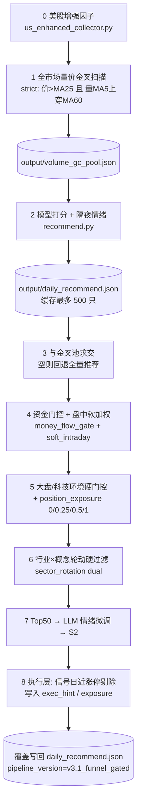

# AlphaPilot V3 管线说明与参数指南

> 目标：把「从全 A 到可执行 TopN」的漏斗逻辑、因子族、门控、产物路径写清楚；并说明哪些参数值得调、怎么调才不虚增准确率。  
> 编排入口：`alphapilot_pipeline_v3.py`  
> 可交易验收协议：见 [`TRADABLE_V3_PLAYBOOK.md`](./TRADABLE_V3_PLAYBOOK.md)

---

## 1. 管线一览

生产漏斗把约 5000 只 A 股层层收窄，最终写出 `output/daily_recommend.json`（通常保留 Top50，**实盘/模拟盘建议只取 Top2 且按仓位缩放**）。



### 步骤职责

| 步 | 模块 | 做什么 | 改不改分 | 删不删票 |
|----|------|--------|----------|----------|
| 0 | `us_enhanced_collector.py` | 拉美股/外盘增强因子（供隔夜/板块侧） | — | — |
| 1 | `scan_volume_gc()` | 严格量价金叉池 | 否 | 是（未进池） |
| 2 | `recommend.py` | 模型打分、筹码过滤、隔夜加成；写出候选 | 是 | 部分（停牌/筹码过散等） |
| 3 | 管线内求交 | 只保留金叉池内标的 | 否 | 是（有回退） |
| 4a | `money_flow_gate.py` | 活跃买/换手/量比/基本面等；S2 加分 | 是 | **基本不硬删**（通过+未通过都可能留下） |
| 4b | `soft_intraday_gate.py` | 盘中资金排名/涨跌/换手软加权 | 是 | **否** |
| 5 | `market_env_gate.py` | 指数 severe → 硬删板/科技行业；仓位阶梯 0/0.25/0.5/1 | 否（hard_only） | 是；nuclear 清空 |
| 6 | `sector_rotation_gate.py` | 行业×概念 dual：流出硬拒 | **否** | 是 |
| 7 | `llm_review` + `apply_s2_weight` | 新闻情绪微调；S2 再乘一次 | 是 | 否 |
| 8 | 管线执行过滤 | 信号日涨幅 ≥ 涨停幅×0.97 不报 | 否 | 是 |

---

## 2. 各层内容详解

### 2.1 量价金叉（硬门槛）

代码：`alphapilot_pipeline_v3.scan_volume_gc`（回测等价：`backtest_v3_pipeline.volume_gc_asof`）

**严格条件（生产）**

1. 收盘价 > MA(close, 25)  
2. 量 MA5 **上穿** 量 MA60：当日 `vm5 > vm60` 且前一日 `vm5 ≤ vm60`  
3. K 线至少 61 根；排除北交所 `bj*`

产物：`output/volume_gc_pool.json`

> 宽松金叉（只要价>MA25 且 vm5>vm60、不要求上穿）仅作回测对照，**禁止作为生产边**。

---

### 2.2 模型打分层

| 路径 | 实际用什么 | 说明 |
|------|------------|------|
| **生产 `recommend.py`（当前代码）** | `screener.load_model(version="v20")` | 工作区仍走 **V20** |
| **可交易回测 / 目标臂** | `vm25_scorer.VM25Scorer(prefer="opt")` | **VM2.5** 三模型集成；与 playbook 对齐 |

若要生产与验收一致，需把 `recommend.py` 接到 VM2.5（仓库内有 `wire_v25_now.py` / `orchestrate_vm25_v3.py` 一类接线脚本）。

#### VM2.5 因子族（打分核心）

| 族 | 内容概要 | 来源 |
|----|----------|------|
| 技术底座 | 收益/波动/成交额比、CMF、VPT、RSI、MACD、布林、均线、ATR、换手、量偏度等 | `features_v2` |
| 资金 | `main_net_today` / `5d` / `10d` | `data/fund_flow_history.json` |
| 两融 / 事件 / 基本面占位 | margin、预告、盈利等 | `data/margin_data.json` 等 |
| 衍生 8 因子 | 量价、量换手、资金×量、动量加速度、趋势强度等 | `auto_factor_engine.derive_factors` |
| 筹码 | 集中度、穿透、成本偏移、形态等 | `chip_data_all.json` |
| 优化技术块 | `opt_ma_*` / `opt_macd_*`（可选 RSI） | `models/best_tech_params.json` |
| 集成输出 | 3×XGBoost 概率均值 | `models/v25_opt_ensemble_{1,2,3}.ubj` |
| 最终分 | `proba * 0.8 + sector_heat * 0.2` | `vm25_scorer.score` |

训练标签（`train_v25.py`）：默认 **前瞻 1 日收益 > 3%**（`FORWARD_DAYS=1`, `THRESHOLD=0.03`）。  
注意：可交易协议是 **T+1 开盘买 → T+2 收盘卖**，与训练标签 horizon **不完全一致**。

`recommend.py` 额外硬过滤（有真实筹码时）：

- `CHIP_CONC70_MAX = 12`
- `CHIP_CONC90_MAX = 15`  
筹码峰过散则剔除。隔夜情绪：命中板块时 `score *= (1 + sector_bonus * 0.20)`。

---

### 2.3 资金门控（生产实现 ≠ 回测 A 臂）

**生产** `money_flow_gate.apply_money_flow_gate` 默认：

| 参数 | 默认 | 含义 |
|------|------|------|
| `min_active_buy` | 0.52 | 主动买入占比下限 |
| `min_turnover` / `max_turnover` | 2.0 / 35.0 | 换手区间 % |
| `min_vol_ratio` | 0.8 | 量比下限 |
| `max_drop_pct` | -5.0 | 当日跌幅过深否决 |
| `check_fundamentals` | True | 有数据时要求净利润/EPS > 0 |

还会算 `main_net_5d/10d`、过热惩罚、S2 规则加分（字段名多为 `s2_bonus`），但 **不会** 像回测 A 臂那样硬删「近 5 日主力净额合计 ≤ 0」。

**回测 A 臂硬规则**（`fund_gate_ok`）：近 5 日主力净额合计 **> 0**，否则剔除。

→ 要对齐验收结果，生产应补上这条硬过滤。

---

### 2.4 盘中软门控（只改分）

`soft_intraday_gate.py`，缓存 `data/intraday_soft_gate.json`。

典型软项：资金排名 bonus、主力净额 tanh、涨跌/换手微调。  
**不删票**。Playbook 立场：可选观察，**不能替代资金硬门控**。

---

### 2.5 大盘环境 + 仓位

`market_env_gate.py`，指数：上证 / 深成 / 创业板指 / 科创50。

| 判定 | 大致阈值 |
|------|----------|
| weak | 5日≤-2% 且 10日≤-1%；或跌破 MA10 且 5日≤-1% |
| severe | 5日≤-5% 且 10日≤-3%；或 3日≤-4% 且 5日≤-4% |
| crash_day | 上证当日涨跌 **且** 深成当日涨跌均 ≤ **-2%** |

生产默认 **Permission Gate**（`permission_gate.py`）：先看截面机会（涨≥3% 宽度 + 行业 3/5/10 日 `sustained_in`），指数只调仓不单独判死刑。

| `position_exposure` | 条件 | 池 `recommend_pool_n` | 下单 `recommend_top_n` |
|---------------------|------|----------------------|------------------------|
| **0.0** | crash_day **且** rotation_dead（无 sustained 且 up3&lt;50） | 0 | nuclear |
| **0.25** | 许可 OFF 非 nuclear；或许可 ON+severe（up3&lt;200） | **Top10** | **Top1** |
| **0.5** | 许可 ON+weak/tech；或 severe 且 up3≥200 | Top50 | Top2 |
| **1.0** | 许可 ON 且指数非弱 | Top50 | Top2 |

草木皆兵（简化版 `caomujiebing_factor.py`）：漏斗内**软加分重排**，不硬删。

对照臂仍保留阶梯 v2（`position_exposure_ladder`）。

风格门控（`soft_demote`，生产默认）：创业板/科创 severe、科技 L1（电子/计算机/通信/传媒/军工）**只降分不删除**；仅 nuclear（`expo=0`）清空。旧硬删模式 `hard_only` 仅作对照。

快照：`output/market_env_snapshot.json`

---

### 2.6 行业 × 概念轮动（硬过滤）

`sector_rotation_gate.py`，`mode="dual"`：

| 行业 | 概念 | 动作 |
|------|------|------|
| deny | * | 拒绝 |
| allow | * | 保留（概念噪声不能否决） |
| neutral | allow | 保留（轮动锋面） |
| neutral | deny / neutral | 拒绝 |

行业/概念 allow、deny 名额与净流入阈值见源码 `classify_sectors` / `classify_concept_sectors`（如行业 `top_allow=20`, `bottom_deny=30`）。

映射与缓存：

- `data/stock_industry_map.json` / `data/stock_concept_map.json`
- `data/sector_flow_*.json` / `data/concept_flow_*.json`
- `output/sector_rotation_snapshot.json`

历史回测目前 **未** as-of 重放 dual（缺每日板块流快照）；生产日更有效。

旧模块 `sector_gate.py`（±3% 软调权）在 V3 中已废弃，`apply_sector_gate` 只转发到硬轮动。

---

### 2.7 LLM 与 S2

- **LLM**：对 Top50 拉新闻 → DeepSeek 情绪，分值夹在约 **[-0.02, +0.03]** 加到 `score`；无新闻中性放行。  
- **S2**：资金门控内已有规则加分；管线末尾 `apply_s2_weight` 读的是 `s2_score`，而门控写的是 `s2_bonus` → **末尾乘法层可能实际不生效**（实现债）。

---

### 2.8 执行层（可成交）

管线内：

- 信号日涨幅 ≥ 板幅 × **0.97** → 不进入推荐  
- 每条写 `exec_hint = buy_t1_open_skip_if_limit; sell_t2_close`  
- 附带当日 `position_exposure`

完整可交易协议（回测）：

| 项 | 规则 |
|----|------|
| 买 | T+1 开盘；开盘涨停/一字不成交 |
| 卖 | T+2 收盘 |
| 成本 | 双边合计 15bp（默认） |
| 成功 | 净收益 ≥ 3% |
| 持仓 | Top2 等权 × exposure |

---

## 3. 关键产物路径

| 产物 | 路径 |
|------|------|
| 金叉池 | `output/volume_gc_pool.json` |
| 日推荐（最终） | `output/daily_recommend.json` |
| 资金流历史 | `data/fund_flow_history.json` |
| 全市场 K 线 | `data/kline_cache/kline_all.parquet` |
| 行业/概念映射 | `data/stock_industry_map.json`, `data/stock_concept_map.json` |
| 板块流 | `data/sector_flow_*.json`, `data/concept_flow_*.json` |
| 盘中软门控缓存 | `data/intraday_soft_gate.json` |
| 环境/轮动快照 | `output/market_env_snapshot.json`, `output/sector_rotation_snapshot.json` |
| VM2.5 模型 | `models/v25_opt_ensemble_*.ubj`, `models/v25_meta.json` |
| 可交易回测 | `output/v3_tradable_top3_backtest.json`, `output/v3_tradable_gated_sleeve_backtest.json` |
| OOS 验收报告 | `output/oos_tradable_top2.json` |
| 模拟盘复盘 | `output/paper_tradable_audit.json` |
| 弱势资金袖套 | `output/weak_fund_sleeve_picks.json` |
| 袖套 vs 空仓回测 | `output/weak_sleeve_vs_empty_backtest.json` |

---

## 4. 参数能不能调？会不会提升「准确率」？

**能调，但多数「调参涨分」是假提升。**  
这里的「准确率」应定义为可交易协议下的：胜率 / hit≥3% / 成交率 / maxDD / 样本外稳定性——而不是信号日收盘价幻想收益。

### 4.1 调参优先级（建议）

| 优先级 | 调什么 | 为什么 | 风险 |
|--------|--------|--------|------|
| **P0 先对齐** | 生产打分改用 VM2.5；补硬资金门 `main_net_5d>0`；关掉或旁路 soft_intraday | 否则调参对象与验收臂不是同一套 | 低 |
| **P1 环境/仓位** | weak/severe 阈值、`position_exposure` 档位 | 已证明可压回撤（A1 maxDD -19.7%→-16.4%） | 中：阈值过严会错过行情 |
| **P1 板块 dual** | allow/deny 名额与净流入阈值；每日落盘快照后再回测 | 硬过滤，直接决定「高分弱势股」出不出 | 高：仅用当日流调参易过拟合 |
| **P2 执行** | 近涨停系数 0.97、开盘涨停跳过、过高开不追 | 提升真实成交与可复制性 | 低 |
| **P3 模型** | 标签 horizon 改为对齐 T+1开→T+2收；重训 `THRESHOLD`/`FORWARD_DAYS`；特征子集 | 才是真正改排序准确率 | **很高**：必须严格 OOS |
| **P4 软加权** | 隔夜 0.2、LLM ±2~3%、soft_intraday、S2 | 最多微调排序 | 很高：易把噪声当 alpha |
| **慎动** | 金叉 MA 25/5/60；芯片阈值；XGB depth/lr | 会改变全宇宙定义，极易刷回测 | 很高 |

### 4.2 哪些「因子参数」真正能动准确率？

1. **模型侧（VM2.5）**  
   - 特征开/关、`best_tech_params`、集成权重 `0.8/0.2`、训练标签与持有期对齐。  
   - **只有样本外（建议 `trained_at` 之后滚动）变好，才算提升。**  
   - 在 2026-04~07 窗上调参有 in-sample 风险（模型约 2026-07-18 训练）。

2. **硬门控侧（环境/板块/资金）**  
   - 不提高单票「预测准」，但提高**组合可交易胜率与回撤**。  
   - 对实盘往往比再抠一个衍生因子更有效。

3. **软门控 / LLM**  
   - 改的是排序噪声，不是新信息边界。  
   - 单独刷高回测命中率时，优先怀疑过拟合或未来函数（盘中点）。

### 4.3 推荐调参流程（防自欺）

```text
1. 固定可交易协议（T+1开 / T+2收 / 成本 / 近涨停 / Top2）
2. 固定生产 = 验收臂（VM2.5 + 硬资金 + 硬环境 + dual）
3. 一次只改一类参数（例如只动 exposure 阈值）
4. 用训练截止日之后的滚动窗验收；同时看 maxDD 与成交率
5. 未过门槛的参数回滚，不叠加进生产
```

### 4.4 实现债状态（2026-07-19 体检后）

| 问题 | 状态 |
|------|------|
| 生产 V20 vs 回测 VM2.5 | **已修**：`recommend.py` → `load_model(v25)`，`ml_screener._load_v25` |
| 生产资金门未硬删 `main_net_5d≤0` | **已修**：`hard_main_net_5d=True`（默认） |
| soft_intraday 默认在路径上 | **已修**：默认关；`ENABLE_SOFT_INTRADAY=1` 才开 |
| 管线 `s2_score` vs 门控 `s2_bonus` | **已修**：双写 + `s2_applied_in_money_gate` 防双计 |
| 金叉过滤为空时回退全量推荐 | **已修**：空池不回退 |
| 训练 T+1 标签 vs 交易 T+2 卖出 | 未改（属模型重训，P3） |
| `ml_screener.py` / `recommend.py` UTF-16 乱码 | **已修**：转 UTF-8 并剥离坏 docstring |

体检脚本：`python3 scripts/pipeline_healthcheck.py` → `output/pipeline_healthcheck.json`

---

## 5. 日常怎么跑

```bash
# 上海机示例
cd /home/ubuntu/alphapilot

# 映射（低频更新）
python3 scripts/build_stock_industry_map_tdx.py --concurrency 16
python3 scripts/build_stock_concept_map_tdx.py --concurrency 20

# 资金流 / K 线按你们现有拉取脚本更新后：
python3 -u alphapilot_pipeline_v3.py

# 验收对照（可交易 + 降仓，默认 Top2）
python3 -u backtest_v3_tradable_gated.py --start 2026-04-01 --end 2026-07-10

# 样本外 Top2 闭环验收（trained_at 之后）
python3 -u scripts/run_oos_tradable_top2.py

# 模拟盘协议复盘
python3 -u scripts/audit_paper_tradable.py
```

读结果时关注：`recommendations`、`position_exposure`、`market_env_flags`、`exec_excluded_near_limit`。  
实盘 / 模拟盘日频：取 TopN（expo&lt;0.5→1，否则 2）× `position_exposure`；开盘涨停跳过；T+2 收盘卖（见 `trade_executor.py`）。

---

## 6. 相关文档与脚本

| 文档/脚本 | 用途 |
|-----------|------|
| `docs/TRADABLE_V3_PLAYBOOK.md` | 可交易协议与验收门槛 |
| `alphapilot_pipeline_v3.py` | 生产编排 |
| `backtest_v3_tradable_top3.py` | 可交易 A/B 对照（默认 Top2） |
| `backtest_v3_tradable_gated.py` | A0 vs A1（环境+仓位） |
| `market_env_gate.py` / `sector_rotation_gate.py` | 硬环境 / 硬轮动 |
| `vm25_scorer.py` / `train_v25.py` | VM2.5 推理与训练 |

---

*文档随代码演进；若步骤或默认阈值变更，以源码常量为准并回写本节。*
